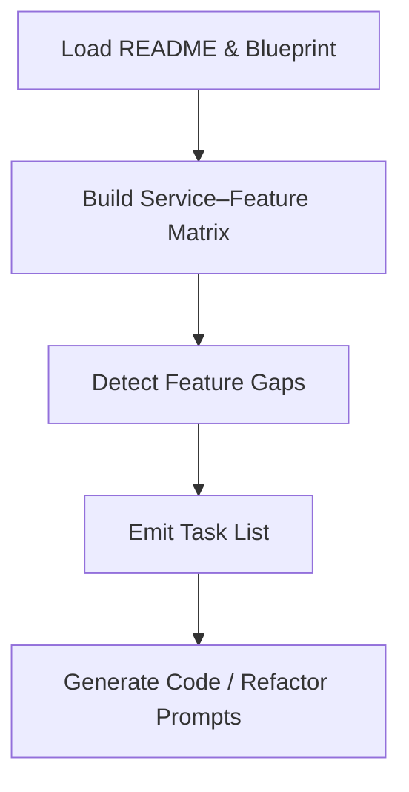
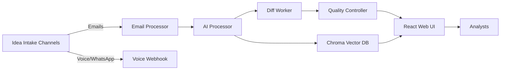

# Cursor Implementation Instructions – Idea‑Centric Platform

> **Purpose**  Provide Cursor with a self‑contained brief that (1) ingests the existing *README.md* project structure, (2) cross‑maps it to the "Theoretical Foundation & Feature Blueprint" canvas, and (3) outputs concrete implementation tasks (code or refactor prompts) for each affected micro‑service.

---

## 1 — Input Files to Load

1. **README.md** – authoritative snapshot of current architecture, services, and endpoints.
2. **Theoretical Foundation & Feature Blueprint** (canvas *686d879b52448191864c608b92dd66d1*) – drives the expected feature set.

> **Tip for Cursor** use the in‑editor `ReadFile` helper to cache both docs into context.

---

## 2 — High‑Level Analysis Workflow



1. **Load & Parse** – extract all service names, ports, and responsibilities from *README.md*.
2. **Matrix Construction** – create a table whose rows = services and columns = blueprint feature buckets (Intake, Linking, Insight, Tracking, Search, Governance, APIs, Metrics).
3. **Gap Detection** – mark cells where service lacks the mapped feature; output `% coverage` per bucket.
4. **Task Emission** – for every gap, emit a *Cursor task* with:
   - `file_path` to edit or create
   - `objective` (one‑liner)
   - `acceptance_criteria` (bullet list)
   - `estimated_complexity` (S / M / L)
5. **Code Generation / Refactor** – for tasks flagged *S* or *M*, auto‑generate inline patch suggestions; for *L* tasks, generate scaffolding & TODO blocks.

---

## 3 — Service Cheat‑Sheet (from README)

| Sub‑Project         | Key Services                                                                                                    | Notes                                                          |
| ------------------- | --------------------------------------------------------------------------------------------------------------- | -------------------------------------------------------------- |
| **Idea Database**   | Email Processor :`3003`, AI Processor :`3004`, Content Extractor :`3005`, Web UI :`3002`                        | All production ready fileciteturn4file0L150-L155           |
| **Real‑Time Intel** | 11 services (News Crawler :`8300`, Macro Watcher :`8301`, …)                                                    | 100 % healthy fileciteturn4file0L156-L167                  |
| **Twin Report KB**  | Topic Manager :`8100`, Document Parser :`8101`, Diff Worker :`8103`, Quality Controller :`8104`, Web UI :`8102` | Gap analysis engine lives here fileciteturn4file0L168-L175 |

---

## 4 — Mapping Blueprint ➜ Services

| Blueprint Bucket               | Primary Target Service(s)          | Cursor Action                                                        |
| ------------------------------ | ---------------------------------- | -------------------------------------------------------------------- |
| **Idea Intake & Capture**      | Email Processor, Content Extractor | Ensure auto‑tagging, duplicate detection, WhatsApp & Voice webhooks. |
| **Linking & Refactor**         | AI Processor, Web UI               | Add typed‑link API + React drag‑connect canvas.                      |
| **Insight Generation**         | AI Processor, Diff Worker          | Implement cluster mining & Gap dashboard.                            |
| **Longitudinal Tracking**      | Diff Worker, Quality Controller    | Embed versioning endpoints & timeline UI.                            |
| **Search & Retrieval**         | Web UI, Chroma service             | Expose semantic + faceted search combo.                              |
| **Collaboration & Governance** | Web UI, Quality Controller         | Role/permission model & review queues.                               |
| **Open APIs**                  | nginx‑gateway, each microservice   | CRUD endpoints, event webhooks.                                      |
| **Metrics & KPIs**             | Grafana/Prometheus stack           | Track graph density, time‑to‑insight, gap closure.                   |

---

## 5 — Expected Cursor Outputs

1. `` – gap matrix (✅/❌) + coverage stats.
2. `` – array of implementation tasks with fields: `id`, `service`, `objective`, `files`, `complexity`, `dependencies`.
3. **Patch Files** – generated code snippets or migration scripts (placed in `patches/`).
4. **Updated Docs** – auto‑append changelog entries to `README.md` under *Next Steps*.

---

## 6 — Quality Gates

- **Lints & Tests Pass** – run `docker‑compose exec <service> pytest` after patch.
- **OpenAPI Valid** – regenerate spec and confirm via `swagger‑validate`.
- **Coverage ≥ 90 %** for modified services.
- **Blueprint Traceability** – each task must reference matching §I/§II number.

---

## 7 — Invocation Prompt Example

```cursor
#SYSTEM: You are a senior platform engineer.
#TASK: Follow the "Cursor Implementation Instructions – Idea‑Centric Platform" document.
#STEP 1: load README.md and Blueprint canvas.
#STEP 2: build and save service_feature_matrix.md.
#STEP 3: emit tasks.json covering all feature gaps (complexity ≤ L).
#STEP 4: generate code patches or TODO scaffolds where feasible.
#OUTPUT: commit all artefacts to repository root.
```

---

## 8 — Diagram: Service–Feature Flow



---

### End of Instructions

Cursor should now execute the workflow autonomously and propose implementation PRs that align the running codebase with the theoretical blueprint.

