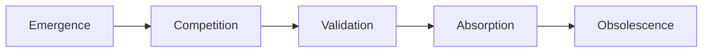
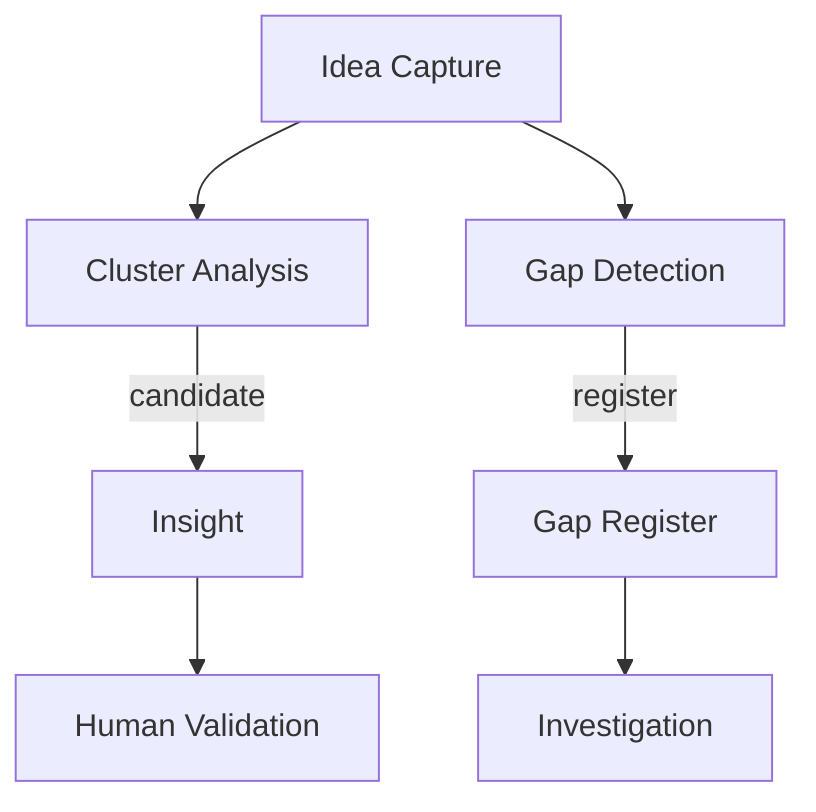
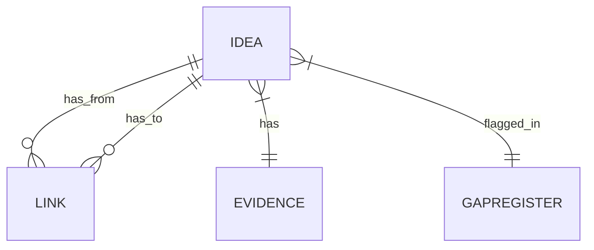

## Part I — Theoretical Foundation

### I‑1. Core Paradigms

- **Zettelkasten (atomic notes & emergent structure).** Every idea is a self‑contained “knowledge atom” that gains meaning through dense cross‑linking.
- **Knowledge Graphs (typed nodes & edges).** Machine‑readable triples enable rich queries and inference across ideas.
- **Formal Concept Lattices.** Formal Concept Analysis uncovers hierarchical, implicit relations, complementing explicit links.
- **Sense‑Making Loops.** Repeating cycle: forage → organise → synthesise → act—aligns human work with AI pipelines.
- **Concept Drift & Topic Lineage.** Track how meanings shift over time (e.g., “blockchain” → “NFT/DeFi”) and record genealogy of topics.

### I‑2. Key Entities & Lifecycles

| Entity           | Definition                                        | Typical Lifecycle Stage\*         | Note                                      |
| ---------------- | ------------------------------------------------- | --------------------------------- | ----------------------------------------- |
| **Idea**         | Atomic claim, concept, or observation             | Fleeting → Literature → Permanent | Follows Zettelkasten atomicity            |
| **Insight**      | Non‑obvious synthesis that reframes understanding | Emergence                         | “Aha!” moment bridging ideas              |
| **Evidence**     | Source fragment that supports/contradicts an idea | Any                               | Carries provenance & credibility          |
| **Gap**          | Missing knowledge or unanswered question          | Catalyst                          | Conceptual, methodological, contradictory |
| **Relationship** | Typed semantic link between entities              | Continuous                        | Formal triple subject–predicate–object    |

\*Lifecycle model: **Emergence → Competition → Validation → Absorption → Obsolescence**.



### I‑3. Relationship Typology

| Category          | Examples                          | When to Use                         |
| ----------------- | --------------------------------- | ----------------------------------- |
| **Supportive**    | supports, evidences, clarifies    | Evidence bolsters a claim           |
| **Contradictory** | refutes, challenges               | Competing findings; flag for review |
| **Refinement**    | specialises, generalises, refines | Taxonomic adjustments               |
| **Causal**        | causes, enables, prevents         | Model mechanisms, root‑cause chains |
| **Inspirational** | influenced, analogises            | Creative link across domains        |
| **Temporal**      | precedes, supersedes              | Versioning & lineage                |
| **Workflow**      | blocks, depends\_on               | Task / project flow                 |

### I‑4. Insight‑Extraction Logic

1. **Cluster Analysis.** Group densely‑linked ideas; novel inter‑cluster bridges are candidate insights (§I‑3).
2. **Gap Detection.** Orphan nodes, unanswered questions, or diff results between corpus versions populate a **Gap Register**.
3. **Concept‑Drift Alerts.** Compare yearly embeddings; if distance > τ, flag concept for revision.
4. **Multi‑Document Synthesis.** Aggregate findings across documents on the same topic to output meta‑insights.
5. **Human‑in‑the‑Loop Validation.** Experts mark AI suggestions as *validated / questionable*; feedback tightens future suggestions.



### I‑5. Quality & Provenance Principles

- **Source Criticism, Corroboration, Hypothesis Testing** guard against bias.
- **Version History & Diffing** maintain trust, highlight change, and support rollback.
- **Lifecycle‑Aware Review**: periodic refresh, retirement tagging, and decay indicators keep content current.

---

## Part II — Product & Data‑Model Blueprint

> Each feature cites its theoretical root—for example, “(links to §I‑3)”.

### II‑1. Data Schema Overview (links to §I‑2, §I‑3)

```jsonc
{
  "Idea": {
    "id": "uuid",
    "title": "string",
    "body_markdown": "string",
    "lifecycle_stage": "emergence|validation|absorption|obsolescence",
    "created_at": "ISO‑8601",
    "updated_at": "ISO‑8601",
    "source_id": "uuid"        
  },
  "Link": {
    "id": "uuid",
    "from_id": "Idea.id",
    "to_id": "Idea.id",
    "type": "supports|contradicts|causes|refines|...",
    "confidence": 0.0,
    "created_at": "ISO‑8601"
  },
  "Evidence": {
    "id": "uuid",
    "idea_id": "Idea.id",
    "excerpt": "string",
    "source_url": "string",
    "quality_score": 0
  },
  "GapRegister": {
    "id": "uuid",
    "description": "string",
    "status": "open|resolved",
    "related_ideas": ["Idea.id"]
  }
}
```



### II‑2. Idea Intake & Capture (links to §I‑1, §I‑2)

| Channel              | Mechanism                                        | Feature                                                  |
| -------------------- | ------------------------------------------------ | -------------------------------------------------------- |
| **Email**            | Gmail OAuth pipeline                             | Continuous ingestion, duplicate detection                |
| **Voice / WhatsApp** | Twilio webhooks → STT → `/ideas` API             | Auto‑transcribe, diarise speaker, create *Fleeting Idea* |
| **Browser Clipper**  | Chrome extension → REST                          | Push highlighted text, URL, tags                         |
| **Bulk Upload**      | Drag‑drop PDFs; content extractor parses & links | Automated metadata tagging                               |

### II‑3. Linking & Refactoring Workflows (links to §I‑3)

- **Graph Canvas**: drag‑connect nodes; type picker enforces controlled vocabulary.
- **AI‑Suggested Links**: embedding similarity & QA heuristics propose *supports/refutes* edges.
- **Batch Refactor**: merge duplicates, split overloaded concepts (concept‑drift alert).
- **Link‑Gardening Wizard**: weekly digest highlights orphans & stale links.

### II‑4. Insight Generation & Gap Analysis (links to §I‑4)

- **Cluster Miner**: Louvain clustering on idea‑link graph → suggests emerging themes.
- **Gap Dashboard**: open questions, diff‑detected omissions, orphan clusters.
- **Meta‑Synthesis**: background worker aggregates multi‑document findings into executive briefs.
- **Human Validation Queue**: experts validate, dispute, or enrich AI insights.

### II‑5. Longitudinal Tracking (links to §I‑1, §I‑2)

- **Timeline View**: volume sparklines & “last‑touched” badges per idea.
- **Versioning**: every edit creates an *IdeaVersion*; Diff Viewer visualises semantic deltas.
- **Concept‑Drift Monitor**: yearly embedding checkpoints raise drift alerts.

### II‑6. Search & Retrieval (links to §I‑3)

- **Semantic Search** (vector) + **Boolean/Faceted** filters (tags, lifecycle, link‑type).
- **Insight Bookmarks**: save complex queries (e.g., contradicted insights > 5 years old).

### II‑7. Collaboration & Governance (links to §I‑5)

- **Roles**: *viewer, contributor, curator, admin*.
- **Review Queues**: new ideas & AI‑generated links require curator approval.
- **Provenance Lineage**: every node displays source chain & edit history.
- **Discussion Threads** & agree/disagree link‑types promote epistemic transparency.

### II‑8. Open APIs & Integrations (links to §I‑1)

- REST & GraphQL endpoints for CRUD on Idea, Link, GapRegister.
- Webhooks on *idea.created*, *link.added*, *gap.resolved* for external sync.
- OAuth‑scoped tokens reuse existing identity layer.

### II‑9. Metrics & KPIs (links to §I‑4, §I‑5)

| KPI                            | Rationale                        |
| ------------------------------ | -------------------------------- |
| Graph Density                  | Health of linking culture        |
| Insight‑Yield Rate             | Efficiency of sense‑making loop  |
| Time‑to‑Insight                | Pipeline latency                 |
| Gap Closure Rate               | Velocity of knowledge maturation |
| Contribution Mix (Human vs AI) | Balance & trust                  |

### II‑10. Future Extensions

1. **Plugin SDK** for custom analytics or visualisations (topic‑lineage heat‑maps).
2. **Ontology Bridges** to external graphs (UMLS, Wikidata) for richer gap analysis.
3. **Adaptive Filtering & Relevance AI** to avoid information overload.
4. **Idea Markup Language (IML)** to synchronise ideas across applications.

---

**How to read this document**

- **Part I** explains the theoretical underpinnings.
- **Part II** maps each theory‑driven point to concrete schema, workflows, and UI/UX patterns.
- Cross‑references (e.g., “§I‑3”) show the direct lineage from concept to feature, ensuring design decisions stay grounded in robust theory.

