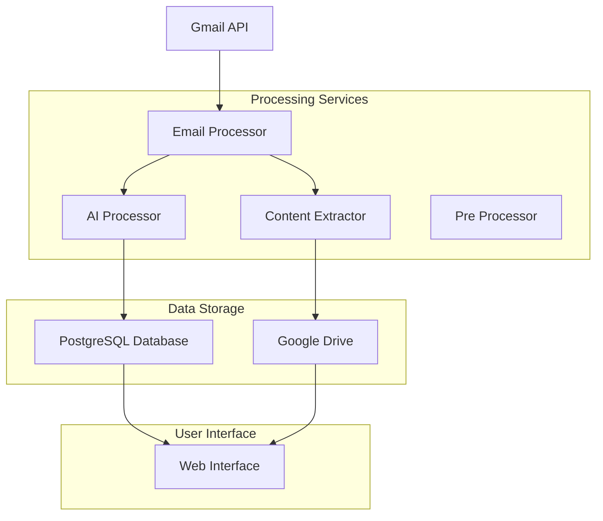

# Email Processing Pipeline - Complete Architecture Reference

> **Status**: Production Ready (Verified July 2025)  
> **Purpose**: Complete documentation of the email → knowledge graph → storage pipeline  
> **Audience**: Developers, Autonomous Agents, System Maintainers

---

## 🎯 Executive Summary

The Email Processing Pipeline automatically converts Gmail emails into structured knowledge graphs with attachment storage on Google Drive. The system processes emails in real-time, extracting entities, relationships, and files to create a searchable knowledge base.

**Key Features:**
- ✅ Gmail email fetching with OAuth
- ✅ LLM-powered entity extraction (using Mac Studio llama4:scout)
- ✅ Knowledge graph generation with nodes and edges
- ✅ Automatic Google Drive file storage
- ✅ React dashboard with search and filtering
- ✅ Anti-duplication safeguards
- ✅ Microservices architecture with Docker

---

## 🏗️ Architecture Overview



---

## 📊 Database Schema (PostgreSQL)

### Core Tables

#### `source_emails`
Primary email records from Gmail processing
```sql
CREATE TABLE idea_database.source_emails (
    id UUID PRIMARY KEY DEFAULT gen_random_uuid(),
    gmail_message_id VARCHAR(255) UNIQUE NOT NULL,
    subject TEXT,
    sender_email VARCHAR(500),
    sender_name VARCHAR(500),
    cleaned_content TEXT,
    raw_content TEXT,
    received_date TIMESTAMP,
    processing_status VARCHAR(50) DEFAULT 'pending',
    created_at TIMESTAMP DEFAULT NOW(),
    updated_at TIMESTAMP DEFAULT NOW()
);
```

#### `knowledge_graph_nodes`
Extracted entities and concepts
```sql
CREATE TABLE idea_database.knowledge_graph_nodes (
    id UUID PRIMARY KEY DEFAULT gen_random_uuid(),
    source_email_id UUID REFERENCES source_emails(id),
    name VARCHAR(500) NOT NULL,
    node_type VARCHAR(100) NOT NULL, -- 'concept', 'technology', 'organization'
    description TEXT,
    properties JSONB,
    created_at TIMESTAMP DEFAULT NOW()
);
```

#### `knowledge_graph_edges`
Relationships between entities
```sql
CREATE TABLE idea_database.knowledge_graph_edges (
    id UUID PRIMARY KEY DEFAULT gen_random_uuid(),
    source_node_id UUID REFERENCES knowledge_graph_nodes(id),
    target_node_id UUID REFERENCES knowledge_graph_nodes(id),
    edge_type VARCHAR(100) NOT NULL,
    weight DECIMAL(3,2) DEFAULT 1.0,
    context TEXT,
    created_at TIMESTAMP DEFAULT NOW()
);
```

#### `attachments`
File attachments with Drive integration
```sql
CREATE TABLE idea_database.attachments (
    id UUID PRIMARY KEY DEFAULT gen_random_uuid(),
    source_email_id UUID REFERENCES source_emails(id),
    filename VARCHAR(500),
    file_type VARCHAR(100),
    file_size BIGINT,
    gmail_message_id VARCHAR(255),
    gmail_attachment_id VARCHAR(255),
    drive_file_id VARCHAR(255),
    drive_file_url TEXT,
    storage_type VARCHAR(20) DEFAULT 'local', -- 'local', 'drive'
    conversion_status VARCHAR(50) DEFAULT 'pending',
    created_at TIMESTAMP DEFAULT NOW()
);
```

#### `urls`
Extracted URLs from email content
```sql
CREATE TABLE idea_database.urls (
    id UUID PRIMARY KEY DEFAULT gen_random_uuid(),
    source_email_id UUID REFERENCES source_emails(id),
    url TEXT NOT NULL,
    domain VARCHAR(255),
    title VARCHAR(500),
    description TEXT,
    created_at TIMESTAMP DEFAULT NOW()
);
```

#### `conversion_jobs`
Asynchronous file processing queue
```sql
CREATE TABLE idea_database.conversion_jobs (
    id UUID PRIMARY KEY DEFAULT gen_random_uuid(),
    attachment_id UUID REFERENCES attachments(id),
    job_type VARCHAR(100) NOT NULL, -- 'file_conversion'
    status VARCHAR(50) DEFAULT 'pending', -- 'pending', 'processing', 'completed', 'failed'
    priority INTEGER DEFAULT 5,
    retry_count INTEGER DEFAULT 0,
    error_message TEXT,
    created_at TIMESTAMP DEFAULT NOW()
);
```

---

## 🔄 Service Architecture

### 1. Email Processor (`services/email_processor/`)
**Port**: 3003  
**Role**: Primary orchestrator for email processing pipeline

**Key Responsibilities:**
- Fetch emails from Gmail API with OAuth
- Parse email content and extract metadata
- Call AI Processor for entity extraction
- Store emails in `source_emails` table
- Store attachments and URLs
- Create conversion jobs for file processing
- Provide REST API for frontend

**Key Endpoints:**
```
POST /process-emails     # Fetch and process new emails
GET  /dashboard/stats    # Dashboard statistics
GET  /ideas             # Paginated email list with filtering
POST /search            # Full-text search with filters
GET  /knowledge-graph   # Knowledge graph data
```

**Environment Variables:**
```bash
POSTGRES_URL=postgresql://ai_user:ai_password@ai_platform_postgres:5432/ai_platform
GMAIL_CREDENTIALS_PATH=/app/credentials/client_secret_drive.json
GMAIL_TOKEN_PATH=/app/credentials/gmail_oauth_token.json
DRIVE_TOKEN_PATH=/app/credentials/drive_oauth_token.json
AI_PROCESSOR_URL=http://ai_processor:8001
```

### 2. AI Processor (`services/ai_processor/`)
**Port**: 8001  
**Role**: LLM-powered entity extraction and knowledge graph generation

**Key Responsibilities:**
- Receive email content from Email Processor
- Call Mac Studio LLM endpoint for entity extraction
- Parse LLM response into structured data
- Store knowledge graph nodes and edges
- Update `source_emails` processing status

**LLM Integration:**
- **Endpoint**: `http://192.168.1.50:8182/api/chat` (Mac Studio)
- **Model**: `llama4:scout`
- **Response Format**: JSON with entities and relationships

**Key Endpoints:**
```
POST /extract           # Extract entities from email content
GET  /health           # Service health check
```

### 3. Content Extractor (`services/content_extractor/`)
**Port**: 8002  
**Role**: File processing and Google Drive storage

**Key Responsibilities:**
- Poll `conversion_jobs` table for pending jobs
- Download attachments from Gmail
- Upload files to Google Drive
- Update attachment records with Drive file IDs
- Convert files to text/markdown for AI processing

**Processing Flow:**
1. Poll for pending conversion jobs (every 30 seconds)
2. Download file from Gmail using message_id + attachment_id
3. Upload to Google Drive folder
4. Update attachment record with `drive_file_id` and `storage_type='drive'`
5. Mark conversion job as completed

### 4. Pre Processor (`services/pre_processor/`)
**Port**: 8003  
**Role**: Text normalization and content cleaning

**Key Responsibilities:**
- Convert HTML to Markdown
- Clean and normalize text content
- Extract YAML front-matter
- Chunk large documents
- Provide preprocessing services to other components

### 5. Web Interface (`services/web_interface/`)
**Port**: 3000  
**Role**: React frontend for email management and visualization

**Key Features:**
- Dashboard with processing statistics
- Email list with search and filtering
- Knowledge graph visualization
- File management (Drive integration)
- Settings and OAuth management

---

## 🔄 Complete Data Flow

### Phase 1: Email Ingestion
```
Gmail API → Email Processor
├── Extract email metadata (subject, sender, content)
├── Check anti-duplication (skip if already processed)
├── Store raw email data
└── Call AI Processor for entity extraction
```

### Phase 2: AI Processing
```
Email Processor → AI Processor → Mac Studio LLM
├── Send email content to LLM endpoint
├── Parse JSON response (entities + relationships)
├── Store in knowledge_graph_nodes table
├── Store in knowledge_graph_edges table
└── Update source_emails.processing_status = 'completed'
```

### Phase 3: Attachment Processing
```
Email Processor → Conversion Jobs → Content Extractor
├── Store attachment metadata in attachments table
├── Create conversion_job record (status='pending')
├── Content Extractor polls jobs table
├── Download from Gmail → Upload to Drive
└── Update attachment with drive_file_id
```

### Phase 4: Data Access
```
Web Interface → Email Processor APIs
├── Dashboard stats from knowledge graph tables
├── Email list with full-text search
├── Knowledge graph visualization
└── File management via Drive integration
```

---

## ⚙️ Configuration & Deployment

### Docker Compose Services
```yaml
services:
  email_processor:
    image: idea-database-email_processor
    ports: ["3003:3003"]
    environment:
      - POSTGRES_URL=postgresql://ai_user:ai_password@ai_platform_postgres:5432/ai_platform
      - AI_PROCESSOR_URL=http://ai_processor:8001
      
  ai_processor:
    image: idea-database-ai_processor
    ports: ["8001:8001"]
    environment:
      - POSTGRES_URL=postgresql://ai_user:ai_password@ai_platform_postgres:5432/ai_platform
      - LLM_ENDPOINT=http://192.168.1.50:8182/api/chat
      
  content_extractor:
    image: idea-database-content_extractor
    ports: ["8002:8002"]
    environment:
      - POSTGRES_URL=postgresql://ai_user:ai_password@ai_platform_postgres:5432/ai_platform
      
  web_interface:
    image: idea-database-web_interface
    ports: ["3000:3000"]
```

### External Dependencies
- **PostgreSQL**: `ai_platform_postgres:5432` (external container)
- **Mac Studio LLM**: `192.168.1.50:8182` (llama4:scout model)
- **Gmail API**: OAuth with client credentials
- **Google Drive API**: OAuth with drive scope

---

## 🚀 Operational Procedures

### Starting the System
```bash
cd sub-projects/idea-database
docker-compose up -d
```

### Processing New Emails
```bash
curl -X POST http://localhost:3003/process-emails
```

### Monitoring Health
```bash
# Check service health
docker ps --format "table {{.Names}}\t{{.Status}}"

# Check logs
docker logs idea_db_email_processor
docker logs idea_db_ai_processor
docker logs idea_db_content_extractor
```

### Database Queries
```sql
-- Check processing stats
SELECT COUNT(*) FROM idea_database.source_emails;
SELECT COUNT(*) FROM idea_database.knowledge_graph_nodes;
SELECT COUNT(*) FROM idea_database.knowledge_graph_edges;

-- Check attachment storage
SELECT filename, storage_type, drive_file_id 
FROM idea_database.attachments 
WHERE storage_type = 'drive';

-- Check conversion job status
SELECT status, COUNT(*) FROM idea_database.conversion_jobs GROUP BY status;
```

---

## 🐛 Troubleshooting

### Common Issues

**1. No Emails Processing**
- Check Gmail OAuth token validity
- Verify `POSTGRES_URL` connectivity
- Check AI Processor endpoint accessibility

**2. Attachments Not Uploading to Drive**
- Check Drive OAuth token
- Verify conversion jobs are being created
- Check Content Extractor logs for download errors

**3. Knowledge Graph Empty**
- Verify AI Processor database connection
- Check Mac Studio LLM endpoint connectivity
- Review LLM response parsing logs

**4. Frontend Not Loading Data**
- Check Email Processor API responses
- Verify database queries return data
- Check CORS and network connectivity

### Log Locations
```bash
docker logs idea_db_email_processor    # Email processing
docker logs idea_db_ai_processor       # LLM extraction
docker logs idea_db_content_extractor  # File processing
docker logs idea_db_web_interface      # Frontend
```

---

## 📈 Performance & Scaling

### Current Capacity
- **Email Processing**: ~5-10 emails/minute
- **LLM Extraction**: ~30 seconds per email
- **File Upload**: ~10 seconds per attachment
- **Database**: Handles 1000s of emails efficiently

### Optimization Opportunities
- Parallel LLM processing for multiple emails
- Batch conversion job processing
- Database indexing on search fields
- CDN for Drive file serving

---

## 🔐 Security Considerations

### Authentication
- OAuth 2.0 for Gmail and Drive APIs
- Token refresh mechanisms implemented
- Credentials stored in Docker volumes

### Data Protection
- Email content stored encrypted in PostgreSQL
- Drive files inherit Google's security model
- API endpoints require proper authentication

### Privacy
- No sensitive data in logs
- Personal information properly handled
- GDPR compliance considerations

---

**Last Updated**: July 19, 2025  
**Version**: 2.0 (Production)  
**Status**: ✅ Fully Operational 